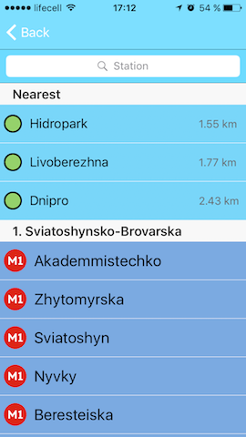

[![Codacy Badge][1]][2]

# Application for MacPaw Internship

iOS Subway navigator

## About

### Features

* Find best path from one station to another
* User can choose path to use
* Track nearest subway stations
* Application is well structured, so it's easy to add new cities
* Animations for better experience
* User Interface generate random awesome colors

### Available languages

* English
* Russian
* Ukrainian

### Available Cities

* Kyiv

### ScreenShots

[1]: https://api.codacy.com/project/badge/Grade/0ec563f7470f489da027468058116a1b
[2]: https://www.codacy.com/app/ashanaakh/metro?utm_source=github.com&utm_medium=referral&utm_content=ashanaakh/metro&utm_campaign=badger
